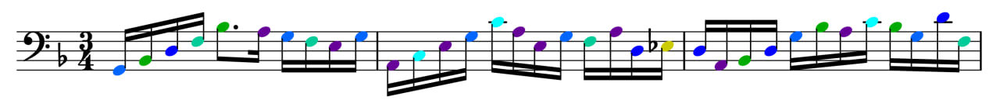

# Phrasewise
A tool for extracting and visualizing melodic lines from MIDI files with harmonic coloring, allowing for focused practice on specific passages.

**_This is an ongoing project, inspired by [Harmonic Coloring](http://www.musanim.com/HarmonicColoring/)._**

Sample output from _Bach Cello Suite No. 2 Prelude_